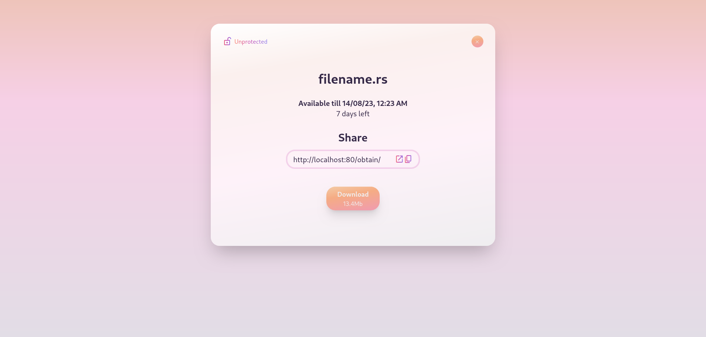

# file sharing

Simple project to understand principles for building fullstack rust applications.

It is in early development stage. I want to make:
- Password protection.
- Cookie authorization (to delete/protect uploaded files).
- Extreamly neat UI.

